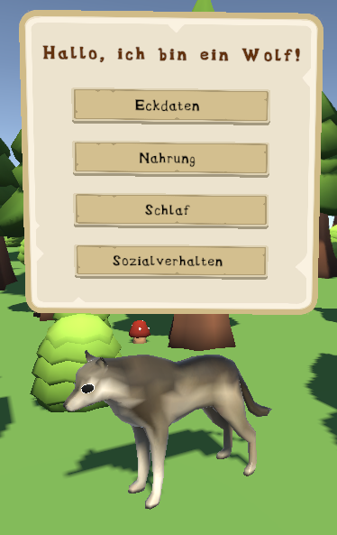

# VR Projekt: Digitaler Wald

## Unsere Idee
Die Idee unseres Projektes ist es, dem Anwender einen virtuellen Wald zur Verfügung zu stellen, in dem sich Tiere frei bewegen, über die man durch Interaktionen etwas lernen kann. Im Laufe der Projektarbeit hat sich unsere Vision des Produktes stark verändert. Das Ziel unserer Anwendung ist es, Lerninhalte über Wildtiere unseres Waldes spielerisch zu vermitteln. Unsere Zielgruppe ist Kinder der fünften und sechsten Klasse, da zu dieser Zeit die Flora und Fauna des deutschen Waldes Thema in der Schule ist. Um die Interaktionen innerhalb des Spiels nicht zu trocken zu gestalten, lassen sich Puzzle über die Tiere, über die man zuvor etwas gelernt hat, lösen und dadurch weitere Tiere freischalten.

Unser Projekt ist optimiert für das Meta Quest 2 Headset und im build Ordner kann die finale .apk gefunden werden.

Unser Projekt ist optimiert für das Meta Quest 2 Headset und im build Ordner kann die finale .apk gefunden werden.

## Das Team 
Alisa Neuber        VR-Funktionalität, Gamelogik & Skelettpuzzle
Lena Beckmann       Tieranimationen & Rigging, Ai-Navigation
Victoria Gehrt      UI-Elemente, Zielgruppenrecherche, Soundrätsel

## Screenshots

### Figuren

### Levels, Umgebung
Unsere Umgebung ist eine Lichtung in einem kleinen Waldstück mit einem Teich. Dort werden sich die Tiere bewegen und man kann mit ihnen interagieren. Unsere Assets für die Flora kommen aus dem ToonTastic Asset-Pack. Da unsere Spieler sich nur begrenzt bewegen können und es keine Teleportation gibt, halten wir den Waldausschnitt eher klein und können uns auf die Details konzentrieren.

Für jedes Tier gibt es drei Rätsel die man Lösen muss: Ein Puzzle bei dem man das Tierskelett zusammenfügen muss, ein Soundrätsel bei dem man herausfinden muss welches Geräusch das gerade akttive Tier macht, und ein Nahrungsrätsel bei dem man das richtige Futter in einen Korb legen muss

### Barrierefreiheit
Um unsere Anwendung für mehr Leute benutzbar zu machen, haben wir uns für einen stationären Spieler entschieden. So muss man sich nicht bewegen oder aufstehen um mit der Umwelt interagieren zu können. Wir achten außerdem darauf, dass die Framerate nicht unter 70 FPS liegt um Motion Sickness zu vermeiden und dass die Schrift der UI groß genug ist. Am Ende des Projektes haben wir uns auch offengelassen, weitere Accessability Features einzubauen. Eine paar Ideen dafür sind zum Beispiel eine Vertonung der Infoboxen und des Tutorial-Screens, um auch sehbehinderten Menschen die Informationen zu übergeben. Außerdem könnte ein High-Contrast-Mode in der Form eines Farbfilters über den Tieren implementiert werden, um das Suchen der Tiere im Wald einfacher zu machen. Dabei können auch richtungsbezogene Captions für die Tiergeräusche helfen. Für barrierefreie Controller könnte man im Nachhinein Button-Remapping durch Spieleplattformen wie Steam oder die Adaptive Controller von Xbox ermöglichen.

## Benutzte Assets
Vegetation:
https://assetstore.unity.com/packages/3d/vegetation/toontastic-vegetation-plants-trees-260738

Figuren/Tiere:
Hirsch: https://assetstore.unity.com/packages/3d/characters/animals/animals -free-260727 
Fuchs: https://www.turbosquid.com/3d-models/3d-model-fox-rigged-1382014
Wolf: https://davidoreilly.itch.io/everything-library-animals

UI:
UI-Images: https://www.kenney.nl/assets/ui-pack-rpg-expansion
Font: https://www.fontget.com/font/fontdinerdotcom-jazz-family/

Sounds:
https://www.soundsnap.com/134_reed_deer_near_xy_wav
https://pixabay.com/sound-effects/search/wolf/ 
https://wildambience.com/wildlife-sounds/red-fox/
https://pixabay.com/de/sound-effects/success-fanfare-trumpets-6185/
https://www.myinstants.com/en/instant/buzzer-89244/

Tische:
https://www.turbosquid.com/de/3d-models/chalkboard-3ds-free/1109342
https://www.turbosquid.com/3d-models/mushroom-coffeetable-set-3d-model-2058641
https://www.moddb.com/news/development-of-the-treeline
https://craftsbliss.com/wp-content/uploads/2020/09/Basket-weaving-reed-and-cane-pattern.jpg

Puzzle-Images:
https://i.etsystatic.com/6394416/r/il/438858/4193869433/il_fullxfull.4193869433_bfer.jpg
https://as2.ftcdn.net/v2/jpg/04/35/71/99/1000_F_435719996_KKufM96x8E2DkiHG0gEjfU6fRbJmKIXV.jpg
https://i.pinimg.com/originals/92/87/1c/92871cd8ee10515c80b77ef13daaa132.jpg

